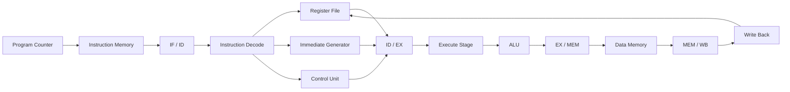

# RISC-V RV32I 5-Stage Pipelined Processor

A modular and synthesizable **32-bit RISC-V (RV32I) 5-stage pipelined processor** implemented in **SystemVerilog**. This project demonstrates the design and implementation of a pipelined CPU based on the RISC-V Base Integer Instruction Set (RV32I), making it suitable for FPGA implementation, RTL verification, and computer architecture learning.

---

## Overview

This repository implements a classic five-stage RISC-V processor consisting of:

* Instruction Fetch (IF)
* Instruction Decode (ID)
* Execute (EX)
* Memory Access (MEM)
* Write Back (WB)

Each stage is implemented as an independent RTL module and connected using dedicated pipeline registers, enabling multiple instructions to be processed simultaneously.

The design emphasizes modularity, readability, and scalability so that additional ISA extensions and advanced architectural features can be integrated with minimal modifications.

---

## Features

* 32-bit RV32I Processor
* Five-stage pipelined architecture
* Modular SystemVerilog implementation
* Separate pipeline registers between stages
* Register file implementation
* ALU with arithmetic and logical operations
* Immediate generation unit
* Instruction decoder
* Control unit
* Branch and jump support
* Synthesizable RTL
* Vivado compatible

---

## Processor Specifications

| Parameter        | Value         |
| ---------------- | ------------- |
| ISA              | RISC-V RV32I  |
| Data Width       | 32-bit        |
| Register Count   | 32            |
| Register Width   | 32-bit        |
| Pipeline Stages  | 5             |
| HDL              | SystemVerilog |
| Target Platform  | FPGA          |
| Development Tool | Xilinx Vivado |

---

## Pipeline Architecture



---

# Pipeline Stages

## Instruction Fetch (IF)

Responsible for fetching the next instruction from instruction memory.

**Major Components**

* Program Counter
* Instruction Memory
* PC Increment Logic

**Outputs**

* Instruction
* Current PC
* PC + 4

---

## Instruction Decode (ID)

Decodes the fetched instruction and generates the required control signals.

**Major Components**

* Register File
* Instruction Decoder
* Immediate Generator
* Control Unit

**Outputs**

* Source operands
* Immediate value
* Control signals

---

## Execute (EX)

Performs arithmetic, logical, comparison, and address generation operations.

**Major Components**

* ALU
* ALU Control
* Operand Selection Logic

Typical operations include:

* ADD
* SUB
* AND
* OR
* XOR
* SLL
* SRL
* SRA
* SLT
* SLTU

---

## Memory Access (MEM)

Handles memory read and write operations.

Supported operations include:

* Load
* Store

---

## Write Back (WB)

Writes computation or memory results back into the destination register.

Possible write-back sources:

* ALU Result
* Memory Read Data
* PC + 4

---

# Pipeline Registers

The processor contains dedicated registers between every pipeline stage.

| Pipeline Register | Stores                                           |
| ----------------- | ------------------------------------------------ |
| IF / ID           | Instruction, PC, PC + 4                          |
| ID / EX           | Register operands, Immediate, Control Signals    |
| EX / MEM          | ALU Result, Store Data, Memory Controls          |
| MEM / WB          | Memory Data, ALU Result, Register Write Controls |

---

# Supported RV32I Instruction Categories

| Category        | Instructions                    |
| --------------- | ------------------------------- |
| Arithmetic      | ADD, SUB, ADDI                  |
| Logical         | AND, OR, XOR, ANDI, ORI, XORI   |
| Shift           | SLL, SRL, SRA, SLLI, SRLI, SRAI |
| Compare         | SLT, SLTU, SLTI, SLTIU          |
| Load            | LB, LH, LW, LBU, LHU            |
| Store           | SB, SH, SW                      |
| Branch          | BEQ, BNE, BLT, BGE, BLTU, BGEU  |
| Jump            | JAL, JALR                       |
| Upper Immediate | LUI, AUIPC                      |

> **Note:** The supported instruction set depends on the modules currently implemented in this repository.

---

# Repository Structure

```text
risc_v_32i/
│
├── src/                # RTL source files
├── simulation/         # Simulation files
├── testbench/          # Testbench
├── program.mem         # Program memory initialization
└── README.md
```

---

# Design Philosophy

The project follows a modular RTL design methodology.

Each architectural block is implemented as an independent module to improve:

* Readability
* Debugging
* Verification
* Reusability
* Scalability

---

# Development Flow

```text
RTL Design
      │
      ▼
Functional Simulation
      │
      ▼
RTL Verification
      │
      ▼
Synthesis
      │
      ▼
Implementation
      │
      ▼
Bitstream Generation
```

---

# Simulation

The processor can be simulated using **Xilinx Vivado Simulator (XSIM)**.

General workflow:

1. Add RTL source files.
2. Add testbench.
3. Load `program.mem`.
4. Run simulation.
5. Observe waveform outputs.
6. Verify register and memory contents.

---

# Future Improvements

Planned enhancements include:

* Forwarding Unit
* Hazard Detection Unit
* Pipeline Stall Logic
* Branch Prediction
* Instruction Cache
* Data Cache
* CSR Instructions
* Exception Handling
* Interrupt Support
* RV32M Extension
* AXI4 Memory Interface
* FPGA Demonstration

---

# Applications

This processor can serve as a foundation for:

* Computer Architecture courses
* FPGA-based CPU implementation
* RTL Design practice
* ASIC Design learning
* Verification projects
* RISC-V experimentation
* Open-source processor development

---

# Tools Used

* **Language:** SystemVerilog
* **Simulator:** Xilinx XSIM
* **EDA Tool:** Xilinx Vivado

---

# Contributing

Contributions, suggestions, and improvements are welcome. Feel free to fork the repository, open issues, or submit pull requests.

---

# License

This project is intended for educational and research purposes. Add an appropriate open-source license (such as MIT or Apache-2.0) if you plan to distribute or accept contributions.

---

# Author

**Daksh Lohchab**

If you find this project useful, consider giving the repository a ⭐ on GitHub.
